## Build Your Own EASM Part 2 - Subdomain Discovery

***

## Description
In Part 1, we looked up company information and found what we believe to be all Apex Domains using a variety of techniques. We did a high confidence validation using Nameservers and certificate information and have compiled a list of Apex domains. Our next step in building out our External Attack Surface is finding all valid Subdomains. After we have done that using passive sources, we will then verify which ones have an IP address and which ones may be old, historic records that are not valid anymore. When you use passive source for DNS, you find instances of subdomains that did exist at one time. Whether they still exist is where the important curation steps will come into play.

## Subfinder
After trying various tools, for passive subdomain discovery I found that Subfinder from Project Discovery is the king of the hill in my opinion. Subfinder is a subdomain discovery tool that returns valid subdomains for websites, using passive online sources. It has a simple, modular architecture and is optimized for speed. subfinder is built for doing one thing only, passive subdomain enumeration, and it does that very well. While you could use active brute force methods like Amass if you have permission to scan the target, we will not be using that method today. 

You can find it here: https://github.com/projectdiscovery/subfinder

Let's start by installing it. It is made in Golang, so make sure you have Golang installed on your system and then run this:
```
go install -v github.com/projectdiscovery/subfinder/v2/cmd/subfinder@latest
```

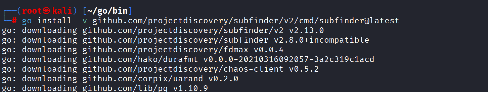

You can look at the help file below:
```
Usage:
  ./subfinder [flags]

Flags:
INPUT:
  -d, -domain string[]  domains to find subdomains for
  -dL, -list string     file containing list of domains for subdomain discovery

SOURCE:
  -s, -sources string[]           specific sources to use for discovery (-s crtsh,github). Use -ls to display all available sources.
  -recursive                      use only sources that can handle subdomains recursively (e.g. subdomain.domain.tld vs domain.tld)
  -all                            use all sources for enumeration (slow)
  -es, -exclude-sources string[]  sources to exclude from enumeration (-es alienvault,zoomeyeapi)

FILTER:
  -m, -match string[]   subdomain or list of subdomain to match (file or comma separated)
  -f, -filter string[]   subdomain or list of subdomain to filter (file or comma separated)

RATE-LIMIT:
  -rl, -rate-limit int  maximum number of http requests to send per second
  -rls value            maximum number of http requests to send per second for providers in key=value format (-rls "hackertarget=10/s,shodan=15/s")
  -t int                number of concurrent goroutines for resolving (-active only) (default 10)

UPDATE:
  -up, -update                 update subfinder to latest version
  -duc, -disable-update-check  disable automatic subfinder update check

OUTPUT:
  -o, -output string       file to write output to
  -oJ, -json               write output in JSONL(ines) format
  -oD, -output-dir string  directory to write output (-dL only)
  -cs, -collect-sources    include all sources in the output (-json only)
  -oI, -ip                 include host IP in output (-active only)

CONFIGURATION:
  -config string                flag config file (default "$CONFIG/subfinder/config.yaml")
  -pc, -provider-config string  provider config file (default "$CONFIG/subfinder/provider-config.yaml")
  -r string[]                   comma separated list of resolvers to use
  -rL, -rlist string            file containing list of resolvers to use
  -nW, -active                  display active subdomains only
  -proxy string                 http proxy to use with subfinder
  -ei, -exclude-ip              exclude IPs from the list of domains

DEBUG:
  -silent             show only subdomains in output
  -version            show version of subfinder
  -v                  show verbose output
  -nc, -no-color      disable color in output
  -ls, -list-sources  list all available sources

OPTIMIZATION:
  -timeout int   seconds to wait before timing out (default 30)
  -max-time int  minutes to wait for enumeration results (default 10)
```

Next you want to make Subfinder so that you dont have to go to the /go/bin folder and do ./subfinder. Let's say your in Kali Linux and subfinder is at /root/go/bin, do this:
```
echo 'export PATH=$PATH:/root/go/bin' >> ~/.zshrc
```
Followed by this:
```
source ~/.zshrc
```
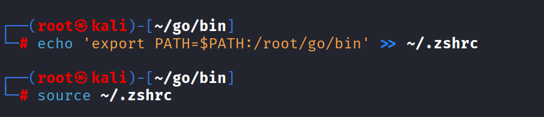


Now in any terminal, from any folder, you can just type subfinder. To see all the sources subfinder uses do:
```
subfinder -ls
```

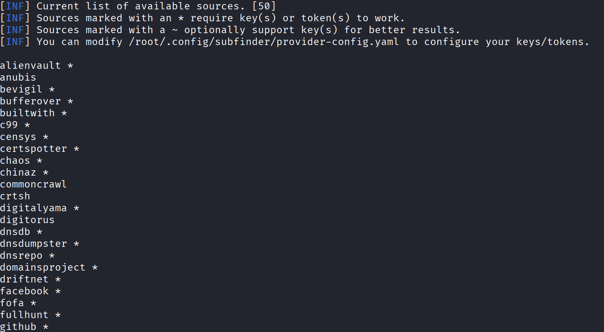

There you see 50 sources. The ones with * in them mean you need to supply an API key for them. You would modify the provider-config.yaml file to enter these. For me this is at /root/.config/subfinder/provider-config.yaml

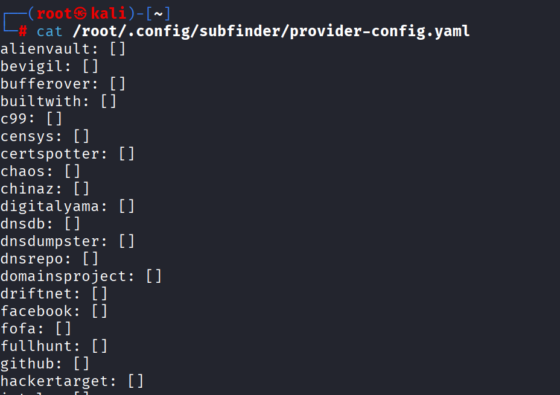

You can supply a single domain with -d or a text file of domains with -dL. Even though this is passive methodology, I will still just use example.com domain for this demo. So to find all subdomains for example.com using all the sources and outputting to a text file, I would do:
```
subfinder -d example.com -all -o all-subdomains.txt
```
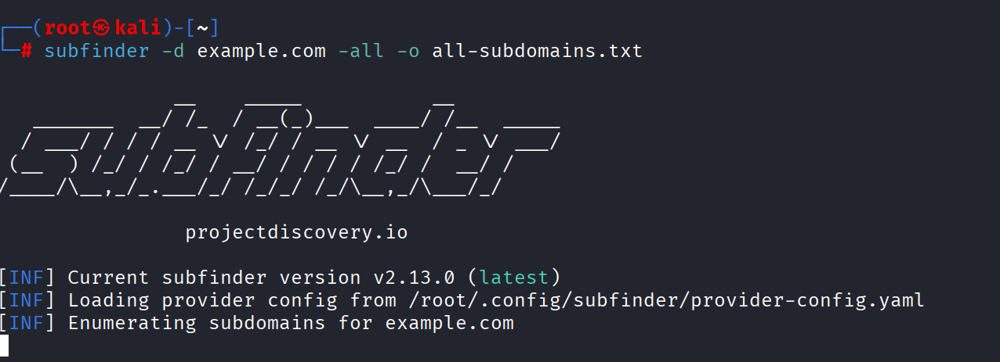

Here we see it found 37,619 subdomains for example.com:
```
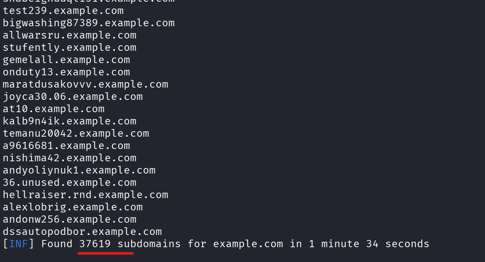

Now, it is highly likely not all of these exist currently, but did at one time. This is called Passive DNS. Passive DNS is a system that records DNS queries and responses as they happen across the internet. Instead of asking a specific server "What is the IP for api.example.com?", a passive DNS database collects results from sensors placed at various points, like Internet Service Providers (ISPs), large recursive resolvers (like Cloudflare or Google), and security researchers. 

Subfinder is strictly a passive tool. It never sends a single packet to your target's actual infrastructure. Instead, it "asks" third-party databases (like Shodan, Censys, or SecurityTrails) what subdomains they have already seen in the past, hence the enormous amount of subdomains for example.com. Let's say you find dev-testing.example.com. Even if the company deleted the record yesterday, if a pDNS sensor saw it once, it's in the database forever. This method is also great for finding "Shadow IT". These are subdomains created by employees for temporary projects that were never officially documented or secured. Having API keys for some of the sources makes it even more robust. 

To see if we can bring down the amount found, we can try a specific switch. If you use the -nW (no-wildcard), it will do a quick active check to see if those subdomains still resolve to an IP address today.
```
subfinder -d example.com -all -nW -o all-subdomains2.txt
```
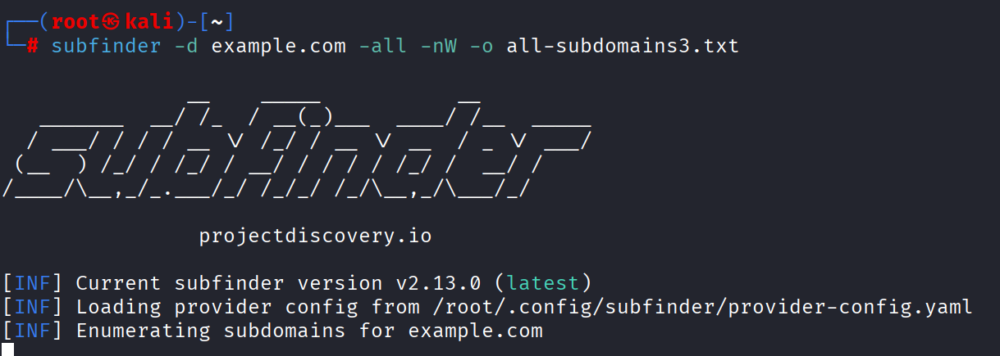
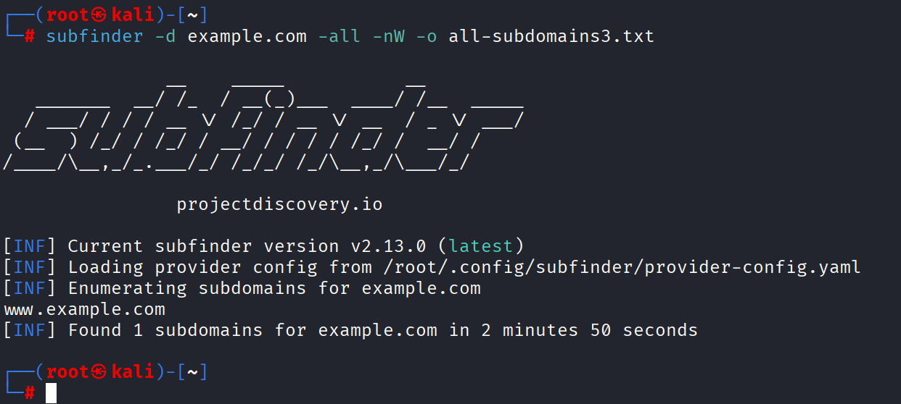

We can see above that it went from 37,619 to 1 (www.example.com) That is pretty insane! Either way, we have now seen the power of Subfinder, and this was without adding any API Keys.

## HTTPX
If you get a list that has thousands of subdomains and you want to find out which ones actually have IPs associated with them, my favorite tool is Project Discovery HTTPX https://github.com/projectdiscovery/httpx The amount of options are staggering as seen by this help file:
```
httpx is a fast and multi-purpose HTTP toolkit that allows running multiple probes using the retryablehttp library.

Usage:
  ./httpx [flags]

Flags:
INPUT:
   -l, -list string              input file containing list of hosts to process
   -rr, -request string          file containing raw request
   -u, -target string[]          input target host(s) to probe
   -im, -input-mode string       mode of input file (burp)

PROBES:
   -sc, -status-code                      display response status-code
   -cl, -content-length                   display response content-length
   -ct, -content-type                     display response content-type
   -location                              display response redirect location
   -favicon                               display mmh3 hash for '/favicon.ico' file
   -hash string                           display response body hash (supported: md5,mmh3,simhash,sha1,sha256,sha512)
   -jarm                                  display jarm fingerprint hash
   -rt, -response-time                    display response time
   -lc, -line-count                       display response body line count
   -wc, -word-count                       display response body word count
   -title                                 display page title
   -bp, -body-preview                     display first N characters of response body (default 100)
   -server, -web-server                   display server name
   -td, -tech-detect                      display technology in use based on wappalyzer dataset
   -cff, -custom-fingerprint-file string  path to a custom fingerprint file for technology detection
   -method                                display http request method
   -ws, -websocket                        display server using websocket
   -ip                                    display host ip
   -cname                                 display host cname
   -extract-fqdn, -efqdn                  get domain and subdomains from response body and header in jsonl/csv output
   -asn                                   display host asn information
   -cdn                                   display cdn/waf in use (default true)
   -probe                                 display probe status

HEADLESS:
   -ss, -screenshot                 enable saving screenshot of the page using headless browser
   -system-chrome                   enable using local installed chrome for screenshot
   -ho, -headless-options string[]  start headless chrome with additional options
   -esb, -exclude-screenshot-bytes  enable excluding screenshot bytes from json output
   -ehb, -exclude-headless-body     enable excluding headless header from json output
   -no-screenshot-full-page         disable saving full page screenshot
   -st, -screenshot-timeout value   set timeout for screenshot in seconds (default 10s)
   -sid, -screenshot-idle value     set idle time before taking screenshot in seconds (default 1s)
   -jsc, -javascript-code string[]  execute JavaScript code after navigation

MATCHERS:
   -mc, -match-code string            match response with specified status code (-mc 200,302)
   -ml, -match-length string          match response with specified content length (-ml 100,102)
   -mlc, -match-line-count string     match response body with specified line count (-mlc 423,532)
   -mwc, -match-word-count string     match response body with specified word count (-mwc 43,55)
   -mfc, -match-favicon string[]      match response with specified favicon hash (-mfc 1494302000)
   -ms, -match-string string[]        match response with specified string (-ms admin)
   -mr, -match-regex string[]         match response with specified regex (-mr admin)
   -mcdn, -match-cdn string[]         match host with specified cdn provider (cloudfront, fastly, google, etc.)
   -mrt, -match-response-time string  match response with specified response time in seconds (-mrt '< 1')
   -mdc, -match-condition string      match response with dsl expression condition

EXTRACTOR:
   -er, -extract-regex string[]   display response content with matched regex
   -ep, -extract-preset string[]  display response content matched by a pre-defined regex (url,ipv4,mail)

FILTERS:
   -fc, -filter-code string               filter response with specified status code (-fc 403,401)
   -fpt, -filter-page-type string[]       filter response with specified page type (e.g. -fpt login,captcha,parked)
   -fep, -filter-error-page               [DEPRECATED: use -fpt] filter response with ML based error page detection
   -fd, -filter-duplicates                filter out near-duplicate responses (only first response is retained)
   -fl, -filter-length string             filter response with specified content length (-fl 23,33)
   -flc, -filter-line-count string        filter response body with specified line count (-flc 423,532)
   -fwc, -filter-word-count string        filter response body with specified word count (-fwc 423,532)
   -ffc, -filter-favicon string[]         filter response with specified favicon hash (-ffc 1494302000)
   -fs, -filter-string string[]           filter response with specified string (-fs admin)
   -fe, -filter-regex string[]            filter response with specified regex (-fe admin)
   -fcdn, -filter-cdn string[]            filter host with specified cdn provider (cloudfront, fastly, google, etc.)
   -frt, -filter-response-time string     filter response with specified response time in seconds (-frt '> 1')
   -fdc, -filter-condition string         filter response with dsl expression condition
   -strip                                 strips all tags in response. supported formats: html,xml (default html)
   -lof, -list-output-fields              list of fields to output (comma separated)
   -eof, -exclude-output-fields string[]  exclude output fields output based on a condition

RATE-LIMIT:
   -t, -threads int              number of threads to use (default 50)
   -rl, -rate-limit int          maximum requests to send per second (default 150)
   -rlm, -rate-limit-minute int  maximum number of requests to send per minute

MISCELLANEOUS:
   -pa, -probe-all-ips        probe all the ips associated with same host
   -p, -ports string[]        ports to probe (nmap syntax: eg http:1,2-10,11,https:80)
   -path string               path or list of paths to probe (comma-separated, file)
   -tls-probe                 send http probes on the extracted TLS domains (dns_name)
   -csp-probe                 send http probes on the extracted CSP domains
   -tls-grab                  perform TLS(SSL) data grabbing
   -pipeline                  probe and display server supporting HTTP1.1 pipeline
   -http2                     probe and display server supporting HTTP2
   -vhost                     probe and display server supporting VHOST
   -ldv, -list-dsl-variables  list json output field keys name that support dsl matcher/filter

UPDATE:
   -up, -update                 update httpx to latest version
   -duc, -disable-update-check  disable automatic httpx update check

OUTPUT:
   -o, -output string                     file to write output results
   -oa, -output-all                       filename to write output results in all formats
   -sr, -store-response                   store http response to output directory
   -srd, -store-response-dir string       store http response to custom directory
   -ob, -omit-body                        omit response body in output
   -csv                                   store output in csv format
   -csvo, -csv-output-encoding string     define output encoding
   -j, -json                              store output in JSONL(ines) format
   -irh, -include-response-header         include http response (headers) in JSON output (-json only)
   -irr, -include-response                include http request/response (headers + body) in JSON output (-json only)
   -irrb, -include-response-base64        include base64 encoded http request/response in JSON output (-json only)
   -include-chain                         include redirect http chain in JSON output (-json only)
   -store-chain                           include http redirect chain in responses (-sr only)
   -svrc, -store-vision-recon-cluster     include visual recon clusters (-ss and -sr only)
   -pr, -protocol string                  protocol to use (unknown, http11, http2, http3)
   -fepp, -filter-error-page-path string  path to store filtered error pages (default "filtered_error_page.json")
   -rdb, -result-db                       store results in database
   -rdbc, -result-db-config string        path to database config file
   -rdbt, -result-db-type string          database type (mongodb, postgres, mysql)
   -rdbcs, -result-db-conn string         database connection string (env: HTTPX_DB_CONNECTION_STRING)
   -rdbn, -result-db-name string          database name (default "httpx")
   -rdbtb, -result-db-table string        table/collection name (default "results")
   -rdbbs, -result-db-batch-size int      batch size for database inserts (default 100)
   -rdbor, -result-db-omit-raw            omit raw request/response data from database

CONFIGURATIONS:
   -config string                   path to the httpx configuration file (default $HOME/.config/httpx/config.yaml)
   -r, -resolvers string[]          list of custom resolver (file or comma separated)
   -allow string[]                  allowed list of IP/CIDR's to process (file or comma separated)
   -deny string[]                   denied list of IP/CIDR's to process (file or comma separated)
   -sni, -sni-name string           custom TLS SNI name
   -random-agent                    enable Random User-Agent to use (default true)
   -auto-referer                    set the Referer header to the current URL
   -H, -header string[]             custom http headers to send with request
   -http-proxy, -proxy string       proxy (http|socks) to use (eg http://127.0.0.1:8080)
   -unsafe                          send raw requests skipping golang normalization
   -resume                          resume scan using resume.cfg
   -fr, -follow-redirects           follow http redirects
   -maxr, -max-redirects int        max number of redirects to follow per host (default 10)
   -fhr, -follow-host-redirects     follow redirects on the same host
   -rhsts, -respect-hsts            respect HSTS response headers for redirect requests
   -vhost-input                     get a list of vhosts as input
   -x string                        request methods to probe, use 'all' to probe all HTTP methods
   -body string                     post body to include in http request
   -s, -stream                      stream mode - start elaborating input targets without sorting
   -sd, -skip-dedupe                disable dedupe input items (only used with stream mode)
   -ldp, -leave-default-ports       leave default http/https ports in host header (eg. http://host:80 - https://host:443
   -ztls                            use ztls library with autofallback to standard one for tls13
   -no-decode                       avoid decoding body
   -tlsi, -tls-impersonate          enable experimental client hello (ja3) tls randomization
   -no-stdin                        Disable Stdin processing
   -hae, -http-api-endpoint string  experimental http api endpoint
   -sf, -secret-file string         path to secret file for authentication

DEBUG:
   -health-check, -hc        run diagnostic check up
   -debug                    display request/response content in cli
   -debug-req                display request content in cli
   -debug-resp               display response content in cli
   -version                  display httpx version
   -stats                    display scan statistic
   -profile-mem string       optional httpx memory profile dump file
   -silent                   silent mode
   -v, -verbose              verbose mode
   -si, -stats-interval int  number of seconds to wait between showing a statistics update (default: 5)
   -nc, -no-color            disable colors in cli output
   -tr, -trace               trace

OPTIMIZATIONS:
   -nf, -no-fallback                  display both probed protocol (HTTPS and HTTP)
   -nfs, -no-fallback-scheme          probe with protocol scheme specified in input
   -maxhr, -max-host-error int        max error count per host before skipping remaining path/s (default 30)
   -e, -exclude string[]              exclude host matching specified filter ('cdn', 'private-ips', cidr, ip, regex)
   -retries int                       number of retries
   -timeout int                       timeout in seconds (default 10)
   -delay value                       duration between each http request (eg: 200ms, 1s) (default -1ns)
   -rsts, -response-size-to-save int  max response size to save in bytes (default 512000000)
   -rstr, -response-size-to-read int  max response size to read in bytes (default 512000000)

CLOUD:
   -auth                           configure projectdiscovery cloud (pdcp) api key (default true)
   -ac, -auth-config string        configure projectdiscovery cloud (pdcp) api key credential file
   -pd, -dashboard                 upload / view output in projectdiscovery cloud (pdcp) UI dashboard
   -tid, -team-id string           upload asset results to given team id (optional)
   -aid, -asset-id string          upload new assets to existing asset id (optional)
   -aname, -asset-name string      assets group name to set (optional)
   -pdu, -dashboard-upload string  upload httpx output file (jsonl) in projectdiscovery cloud (pdcp) UI dashboard
```

To install:
```
go install -v github.com/projectdiscovery/httpx/cmd/httpx@latest
```

You make a text file list of all your subdomains (like the output from your Subfinder run) and run HTTPX against it. Here is an example:
```
httpx -l test-targets.txt -sc -location -favicon -server -title -td -ip -cname -cdn -fr -fhr -oa -o test-target-scan
```
* -l is for your text file list of domains
* -sc is for getting the HTTP Status Code
* -location is for when it redirects, where is the location it redirects to
* -favicon is the favicon hash of the icon picture on the site
* -server is the webserver
* -title is the title of the HTML page
* -td is TechStack detection
* -ip gets the IP address
* -cname gets the cname 
* -cdn gets the content delivery network
* -fr means follow redirects
* -fhr means follow redirects on the same host
* -oa means output in all formats, json, text and csv
* -o is for the name you want on all of those outputs

For me I used the -u for a single host and scanned scanme.nmap.org, which does allow you to scan them. Never do these scans against a target you dont have permission to. 

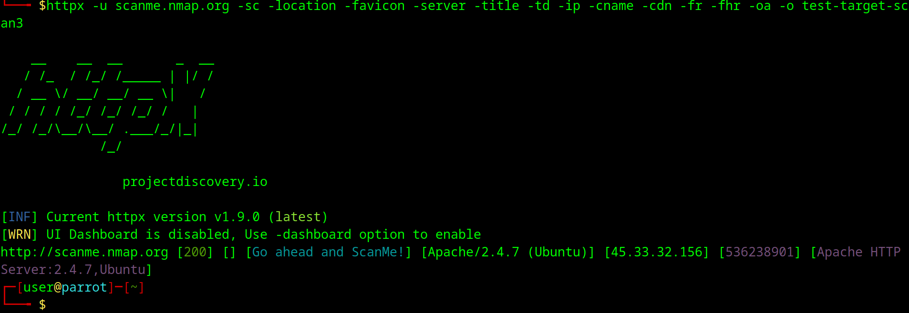
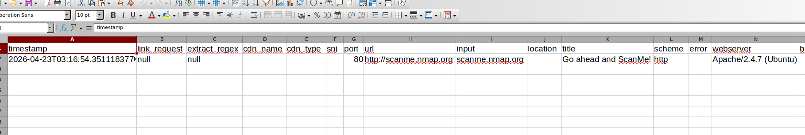

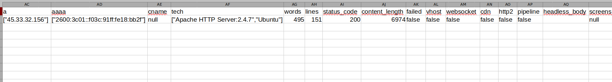

You can see it gives quite a bit of detail in the excel report. This is great if you have hundreds of targets you want this information for as you can just feed it the list and have it run and then filter the excel report after for specific things. 

## Summary
These are the two main tools I use to find subdomains and which ones are actually live. I hope you enjoyed this lesson in building your own External Attack Surface Management workflow.


