# Intel Bytez - Apex Discovery

***

## Summary 
An External Attack Surface Management tool is important for a company to have so it can understand its public facing external assets, and what possible vulnerabilities may lie amongst these assets. There are many commercial products out there that claim to do the whole suite of EASM, but in my own opinion, after trying several, most are lacking significantly. Which led me to building my own EASM process using a variety of techniques and tools. This series will cover this topic, with the first one being about discovery.

## Terminology
First, we need to agree on some basic terminology. As most of your external assets will likely be servers of some kind, they will likely be reachable via a domain or subdomain you own. The first type of domain is an Apex domain. This would be the root domain in which subdomains can be built from. Let's say my company is Wingnut Inc. and I purchase the domain wingnut.com, this is an Apex domain. Then I set up some DNS records and create some subdomains like wwww.wingnut.com, training.wingnut.com, etc. The goal of an attacker is to find all Apex and subdomains that you own so they can start mapping out your environment. As an example, if the attacker found salesforce.wingnut.com, they have an idea of the technology behind it and that you are likely running Salesforce. 

## Company Info
In this first exercise, my goal is to mimic what an attacker would do to find everything possible using public sources about a company. We want to mimic having zero insider information and just start from scratch and build out our mapping. In my workflow I always start with Open Corporates. This let's you look up a company name and discover some details about the company including any subsidiaries or acquisitions they have done. If I am an attacker, I not only want to map out the main company, but also any sub-companies tied to it as well as there would possibly be weaknesses in these smaller acquisitions that the major company wouldnt have. Let's use a big company that we know has different branches, like Dell Inc. 
1. Go to https://opencorporates.com/
2. Type in Dell and search for it. To narrow down, google where Dell's headquarters are and it should say 1 Dell Way Round Rock Texas. This means on the right side we can select Texas to narrow down the search. Also, select "exclude inactive"
3. Once you find a Dell that has an address of 1 Dell Way, click it and look for the Parent Company. You will notice it is Dell Inc. in Delaware,. Click that
4. Scroll down until you see Subsidiaries. These would more often than not be companies controlled by a parent company, in this case Dell Inc. I have found acquisitions of a company before using this technique. This may be a very large number, but you get the idea. You would want to visit some direct subsidiaries of Dell Inc here to gather more possible names which may result in more possible Apex domains to search for. 

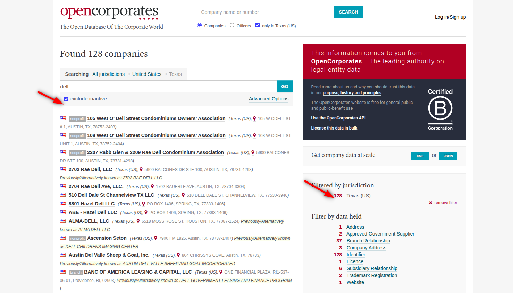

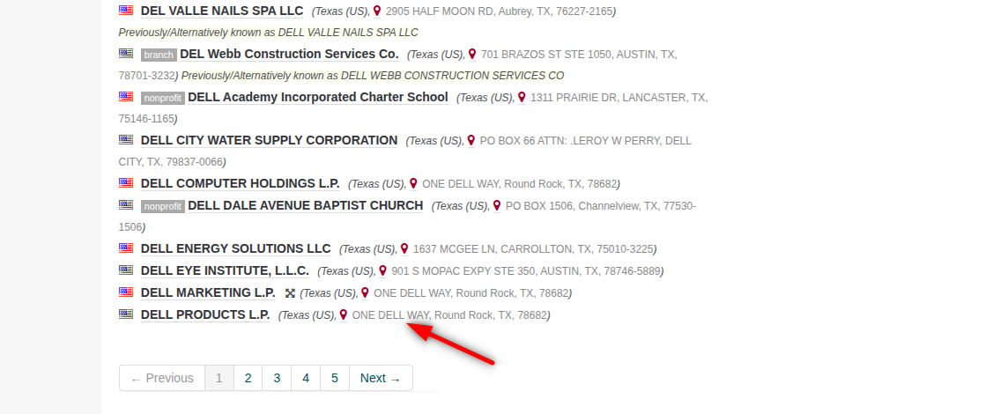

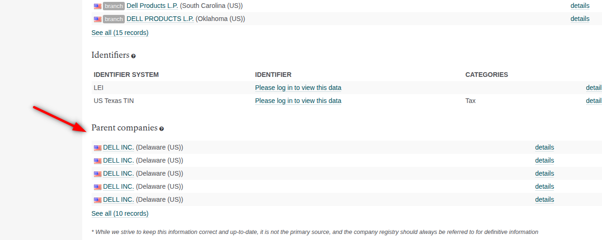

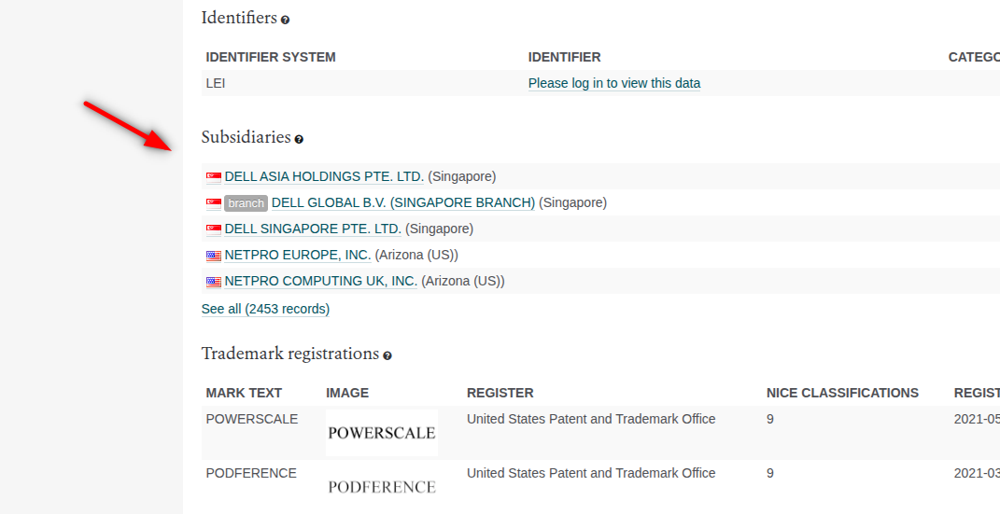

There are other things about a company you can search here at Open Corporates, like Trademarks, SEC Filings, etc. but let's move on to Apex Domain discovery.

## Domain Discovery
One of my main ways to discover Apex domains is via Reverse Whois. Sites that let you look at the Whois history are very helpful as you can look at a bunch all in one go. I usually start at Whoxy.
1. Navigate to https://www.whoxy.com/reverse-whois/ and search for dell.com
2. In the past, there were not too many companies using privacy services to hide their name in Whois lookups. Nowadays we see it often, where you do a normal Whois lookup but the names are redacted. With Whois history we see the company name from earlier years if they never hid it before. We see this is the case with Dell, it looks like they started hiding the name around Septemeber 2022, but prior to that we see the name Dell Inc. This has a clickable link to look at 50,702 domains under Dell Inc. We also see an email address of dnsadmin@dell.com, which we can use later. Do note that with Whoxy, they won't show you all domains if your using it for free. We also see the Registrar as SafeNames LTD
3. Clicking on the link for the 50,000 domains we can see a variety of Dell related apex domains. Companies buy up a lot of these because they dont want the bad guys buying them and creating phishing pages with them. 
4. A more paired down list can be seen by clicking the link by the dnsadmin@dell.com email
5. Even more paired down would be clicking where it says Dell Domain Administrative Contact.
6. You can see that you have a large swathe of apex domains that may be owned by Dell, but we can check other sources to see if any of these show up in other sources and make our list off of ones we see multiple times. 

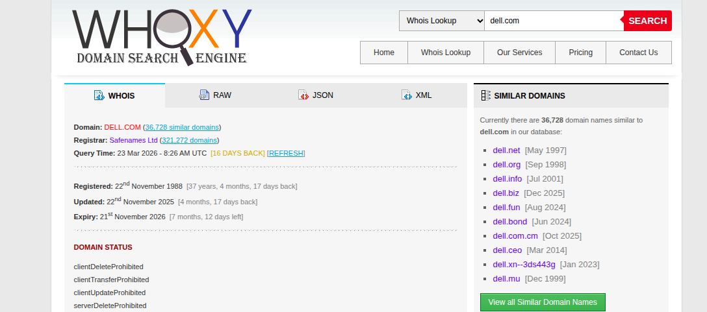

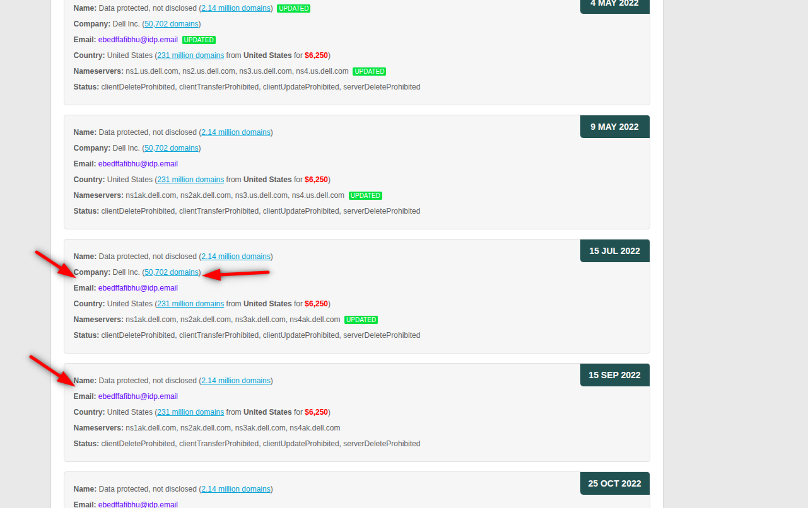

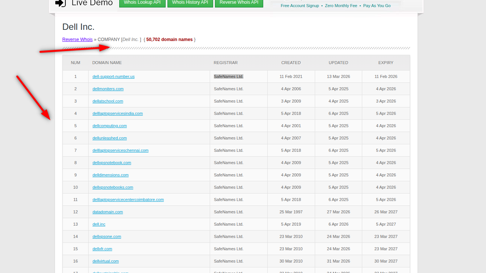

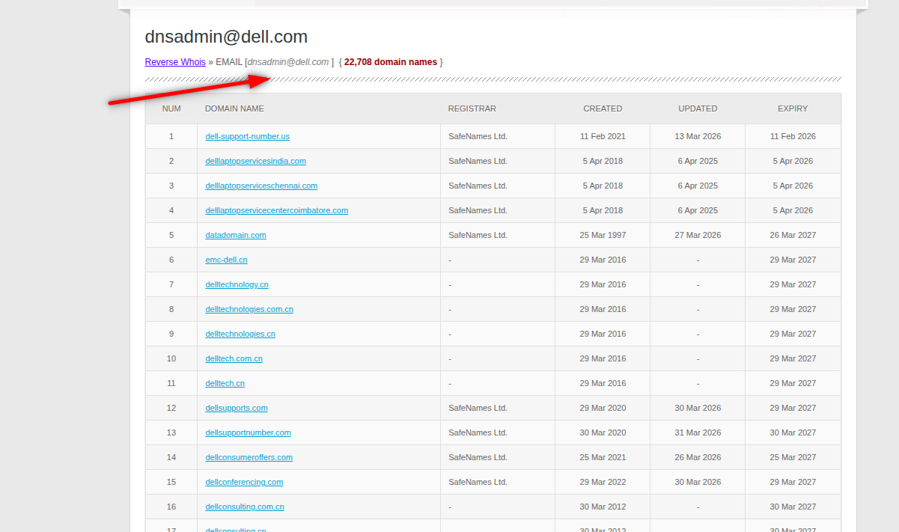

7. Go to https://viewdns.info/reversewhois/ and you can see it let's you put in a Registrar or an email address. The Registrar SafeNames LTD has about 5000 domains that dont all look to be tied to Dell, so let's do the dnsadmin@dell.com one. This one returns around 3,245 domains. This is a bit more reasonable and manageable to start with. Its not 100% guarantee that these are owned by Dell Inc but it is a high possibility. Plus the domain names look like Dell properties. We also see variations of Alienware, which is owned by Dell, so thats another pivot you could work on.
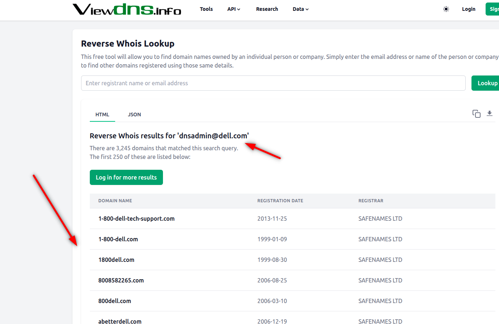

8. Another site to see company and whois history details is https://whois.easycounter.com/dell.com.

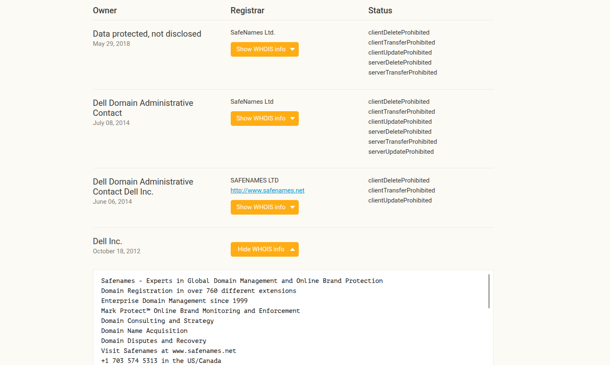

You would compile your list of possible Apex domains using methods such as these, and then pair it down as you do more discovery with other tooling later. I usually stick with the ones I find with the email address, and some with the direct company name. The goal is to find at least two or three independent technical links between your primary target (e.g., dell.com) and the mystery domain. Nameservers are where its at for validating as it is one of the more reliable checks. If the mystery domain uses the company’s custom name servers, it is almost certainly legitimate.

If mystery-domain.com uses ns1.dell.com or amerns.dell.com, it is confirmed. There are some tools that can gather DNS information from a bulk list of domains, like Project Discovery dnsx https://github.com/projectdiscovery/dnsx. You can use the -recon switch to get DNS info.

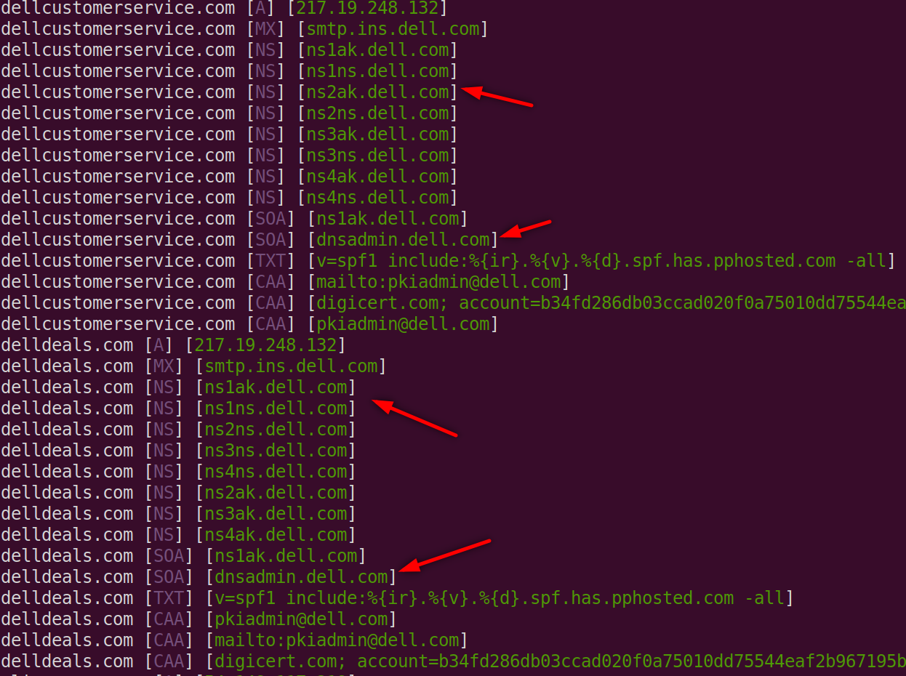

Once you get a nameserver used by the main domain dell.com, you can plug that into https://viewdns.info/reversens/?ns=ns3ns.dell.com to find domains using that nameserver. A couple of examples are dellcustomerservice.com and delldeals.com. If we run dnsx with the recon switch, we see dellcustomerservice.com has multiple nameservers, like ns1ak.dell.com and we also see the email is dnsadmin@dell.com. Our confidence went up considerably that this is indeed a Dell Inc owned domain. The same is true for delldeals.com. 

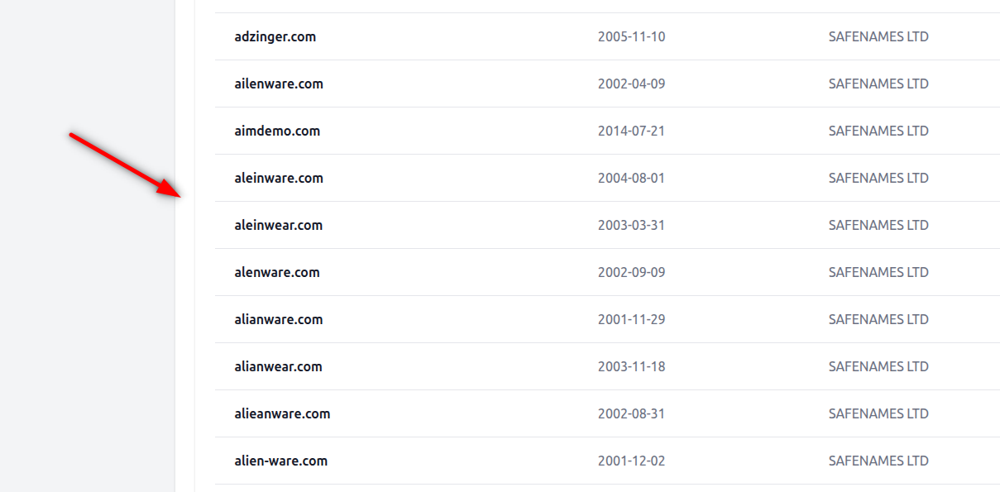

Another outlet is using Analytics info with BuiltWith. Go to https://builtwith.com/, type in Dell.com and hit search then the Relationships tab.

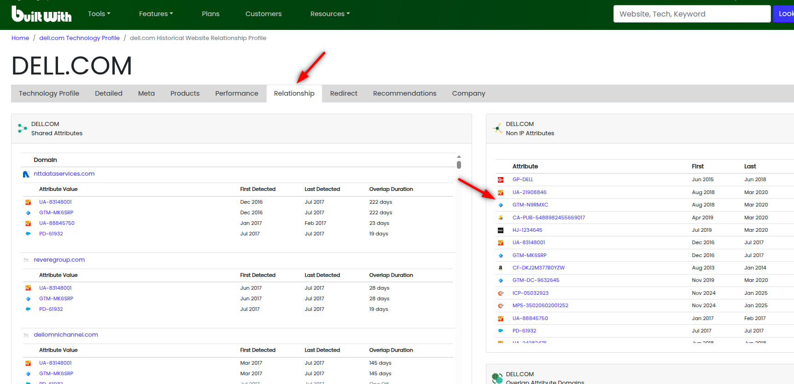

When you see codes like UA-, G-, or GP-, you are looking at unique tracking IDs embedded in the website’s source code. Because these IDs are used to aggregate data into a single dashboard for the company, finding a shared ID between two domains is almost like finding a shared DNA profile. BuiltWith also tracks "Non-IP Attributes." These are identifying markers that aren't tied to a server address but are unique to how the company set up their site. Viewing these IDs, you can see there are more domains.

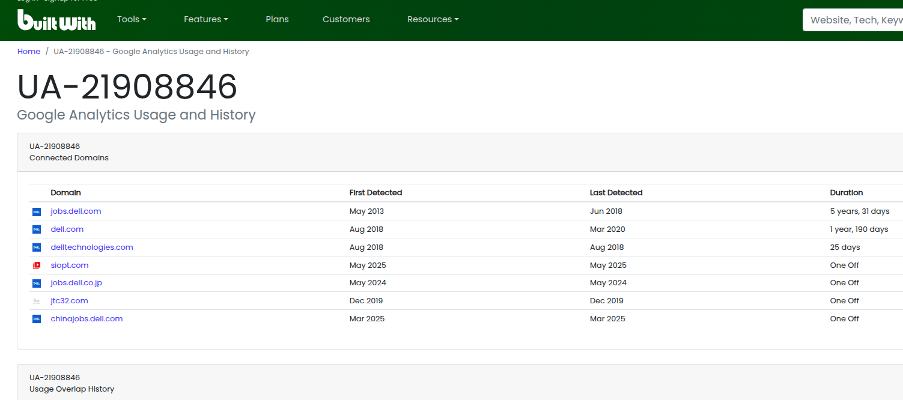

Some of these will show last seen dates of like 2018, but don't sleep on these as we will see in the next section.

Now that we know some ways we can increase our confidence that an Apex domain is indeed owned by the target company, let's do a couple of examples. Looking at the BuiltWith screenshot above we see delltechnologies.com and that it was last detected in 2018. Some may say that they don't want to waste their time with this based on the date. If we plug it into Whoxy, we can see it is still active and we also see the same registrar as dell.com, and our high confidence validation of the same nameservers as dell.com. 

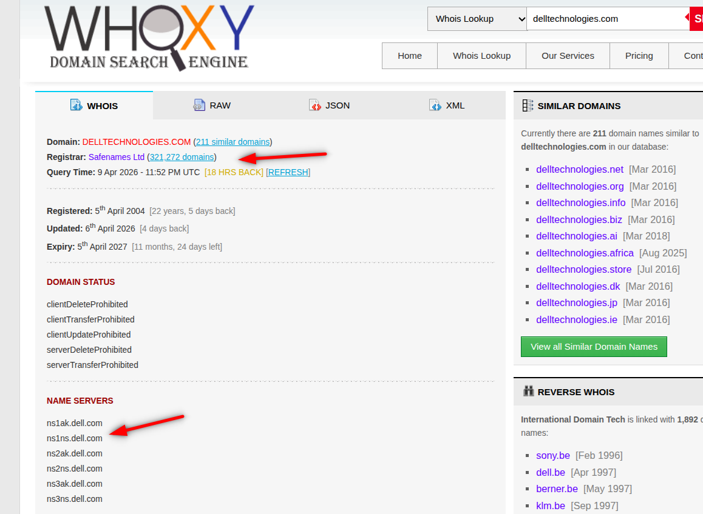

We now have a very high confidence that this is owned by dell.com, but we can try a second validation to bring that up higher. Some of these Apex domains may have a site tied to it and an SSL certificate. The second validation would be if the SSL certificate is assigned to the target company and the Subject Alternative Names are representative of the target company. If we go to https://crt.sh/?q=delltechnologies.com and look at a recent certificate, you can see all of those things are true.

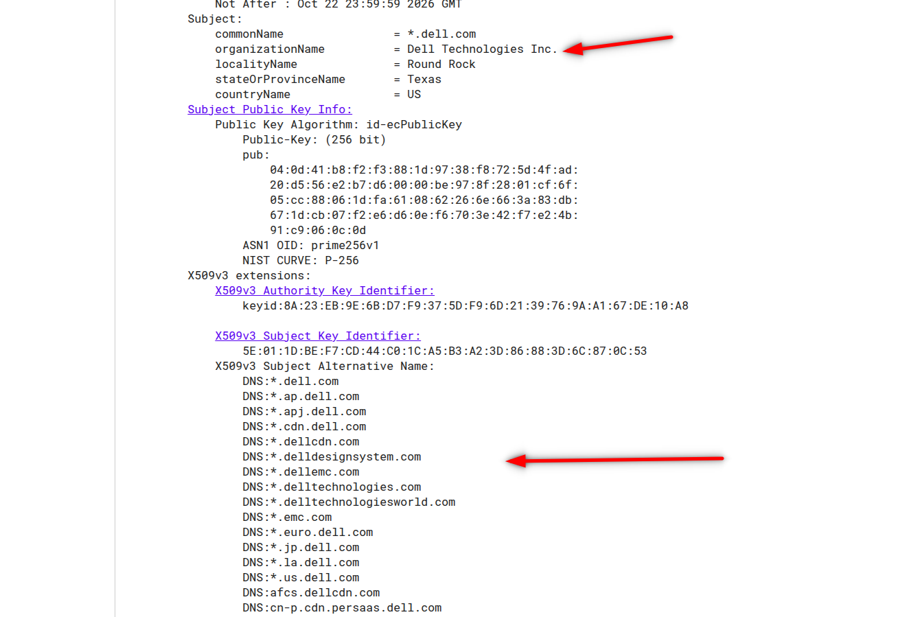

Our confidence has hit its highest level now. Let's do a second one to show another side. We already know that one of the official nameservers for dell.com is ns1ak.dell.com. We can do a reverse nameserver search to see which domains use this nameserver, bringing confidence that this Apex is owned by the target. If the mystery domain uses the company’s custom name servers, it is almost certainly legitimate. Only someone with administrative access to the Dell network can point a domain to ns1ak.dell.com. We go here: https://viewdns.info/reversens/ and put in ns1ak.dell.com

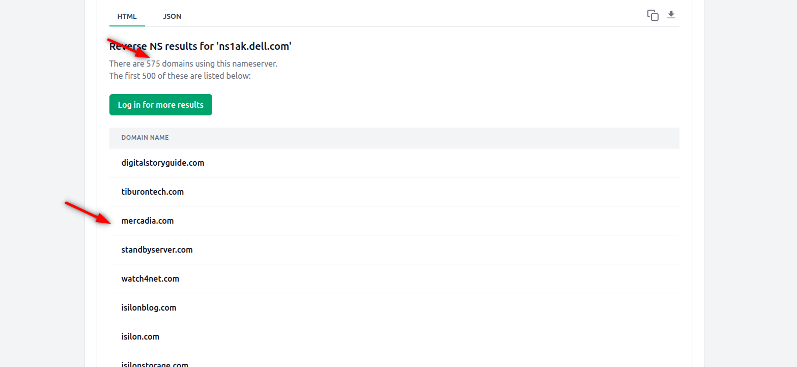

Here we see a domain that doesnt look anything like a dell asset, mercadia.com. Let's put it in Whoxy just to verify the nameserver and registrar

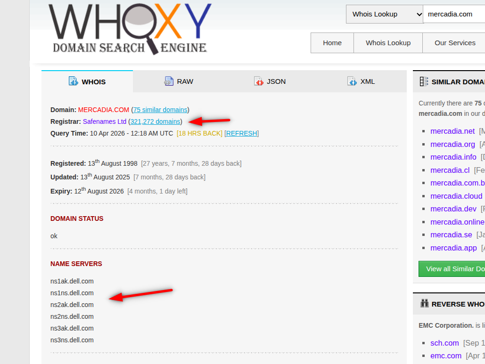

There we do see the same nameservers and registrar as dell.com. Now let's check for certificates at crt.sh.

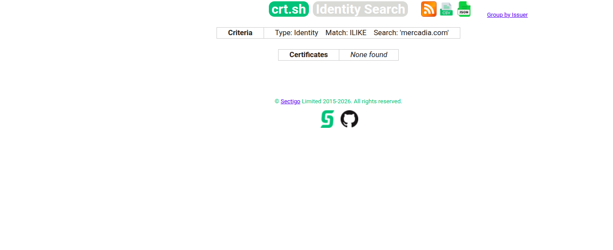

We see there is no certificate. This shows that we can still have a high confidence Apex domain without it being a site or having an SSL cert. 

To summarize, you find the target's main site, find its nameservers, do a reverse NS search to get other high confidence apex domains tied to the target, then do a final check for a certificate to verify the SAN and the company the certificate is issued to. This will give you a good list to start doing further recon on. There may be other domains and ones from partners and acquisitions, but this method can get you started on a good path. 
