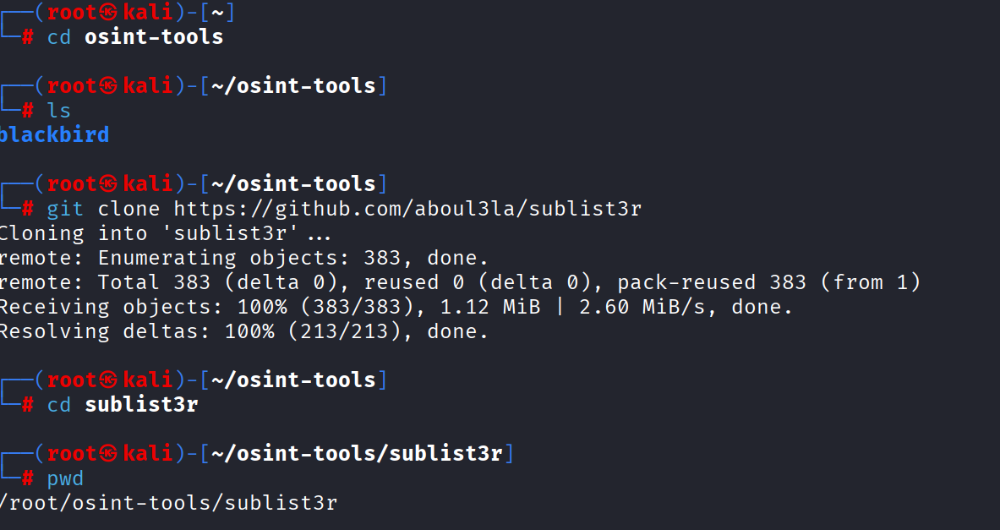
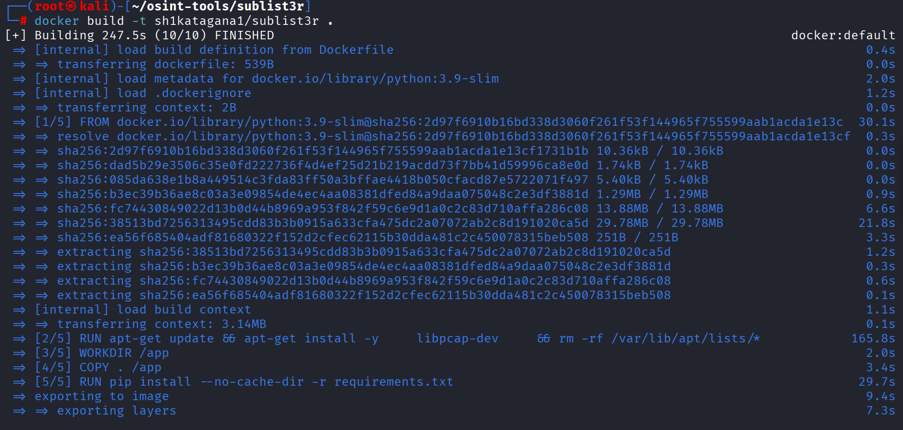
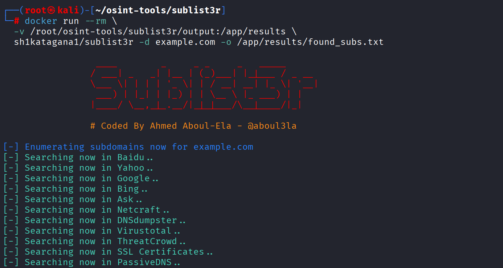
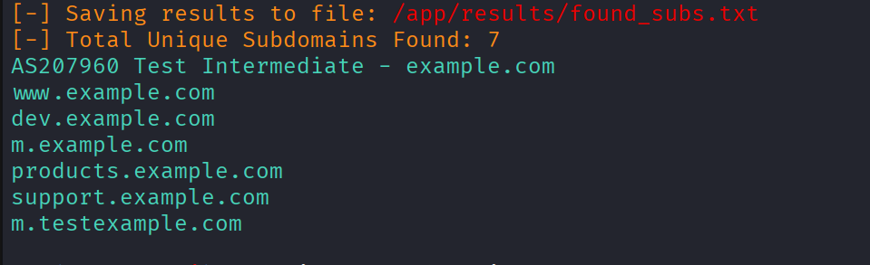
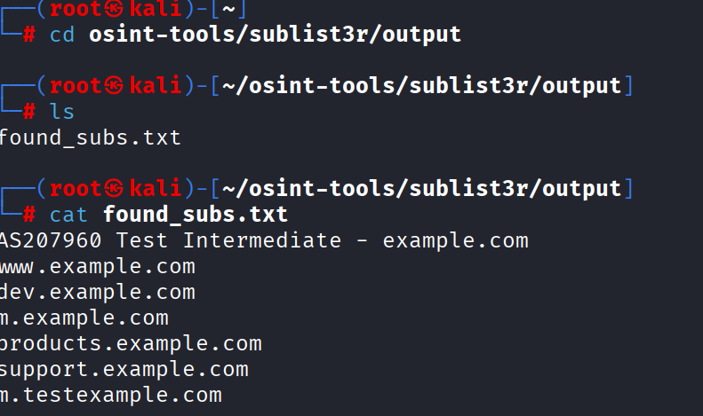
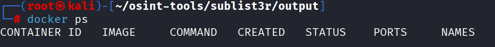
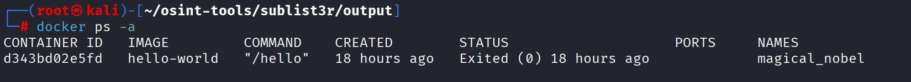
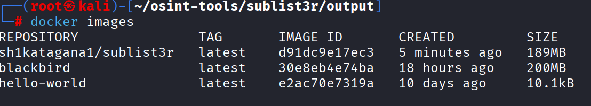

# Intelbytez - Dockerize OSINT Tools

***

## Goal
As I build out what OSINT tools I want to use for an overall OSINT framework or Telegram OSINT bot, It would be wise to make them so they run in Docker. This would alleviate issues where some tools require a specific version of a dependency. This tutorial is how to make a Github project that doesnt use Docker, able to use Docker.

## What is Docker?
Think of Docker as a way to "package" an application with its entire environment.
1. Dockerfile: The "recipe." A text file with instructions on how to build your environment.
2. Image: The "frozen" version of that environment. You build the image once.
3. Container: The "living" instance. You run the image to create a container.

## Anatomy of a Dockerfile
When you clone an OSINT tool, your Dockerfile generally follows this flow:
1. FROM - The base operating system or language. Example: FROM python:3.9-slim
2. WORKDIR - The "home" folder inside the container. Example: WORKDIR /app
3. COPY - Moves files from your PC into the container.Example: COPY . .
4. RUN - Commands to install dependencies. Example: RUN pip install -r requirements.txt
5. ENTRYPOINT - The command that runs when the container starts.Example: ENTRYPOINT ["python", "tool.py"]

In Docker terminology, python:3.9-slim is what we call a Base Image. Think of it as the foundation of your house; before you can install your OSINT scripts, you need an operating system and a language interpreter (Python) already set up. The name is structured as Repository:Tag, in this case the repository is python and the tag is 3.9-slim. This is an environment that just contains whats needed to run Python scripts. 

Docker grabs this from Docker Hub. It first checks to see if you already have it downloaded, if not, it pulls it from Docker Hub, in this case Python's official Docker Hub. If your tool is in Golang and not Python, you could use the golang:1.21-alpine image. 

As far as the WORKDIR part, if you use FROM alpine, you are starting with a bare-bones Linux file system. It has the standard folders like /bin, /etc, and /usr. WORKDIR /app makes a folder in root called app and then CD's into it. You could install everything to root, but it may get messy and its best to have a dedicated, created folder for your tool.

## Output
What if your tool has a -o output option and you need that file on your host system? You would need this because once a container is stopped (when using rm command) it removes the /app folder, which in turn removes the /app/output folder. To get your OSINT results out of the container and onto your actual computer in Texas, you use a Volume Mapping (also called a "Bind Mount"). Think of a volume map as a permanent tunnel between a folder on your computer and the folder inside the container. When the tool writes results.txt inside the container, it instantly appears on your physical hard drive because of that tunnel. 

When you run your tool, you add the -v (volume) flag. The syntax is always [Path on your PC] : [Path inside Container].

Example (if you created a folder in your cloned folder called my_results):
```
docker run --rm \
  -v /home/user/osint_project/my_results:/app/results \
  sh1katagana1/my-osint-tool
```
1. --rm: Automatically deletes the container "shell" after it's done (keeping your system clean).
2. -v: Creates the tunnel.
3. $(pwd): A handy shortcut for "current working directory" so you don't have to type the full path.

## Test
The best way to understand all of this is to create a dockerized tool. For this example, I will use the tool sublist3r https://github.com/aboul3la/sublist3r because it doesnt come with a Dockerfile already.

Start by making a tools folder in your environment. For me, I am on Kali Linux and I made a folder called osint-tools
```
git clone https://github.com/aboul3la/sublist3r
```
CD into the sublist3r folder and make a new folder for output
```
mkdir output
```


Take note of what is in the sublist3r folder, specifically the requirements.txt folder. We will need our Dockerfile to tell it to run pip install for the requirements. Inside of our Sublist3r folder, create a Dockerfile
```
nano Dockerfile
```
Paste this in (expecting that your naming the same way I am naming, change according to your own paths)
```
# Use Python 3 slim for a small footprint
FROM python:3.9-slim

# Install dependencies for Sublist3r (it needs flock and net-tools sometimes)
RUN apt-get update && apt-get install -y \
    libpcap-dev \
    && rm -rf /var/lib/apt/lists/*

WORKDIR /app

# Copy the cloned files from your Kali folder into the container
COPY . /app

# Install the python dependencies
RUN pip install --no-cache-dir -r requirements.txt

# Set the entrypoint to the sublist3r script
ENTRYPOINT ["python", "sublist3r.py"]
```
Build the Docker image from it. This command will tag it as well so its easy to find, I am using a convential username/toolname syntax for this, change according to what you want. Dont forget the trailing period
```
docker build -t sh1katagana1/sublist3r .
```


What you have now done is made a permanent image that you can run in a container for a moment in time then stop it, then run it again. Each time, the container will be destroyed due to the --rm command, so you will not see it with ps -a  when you stop the container. Let's run the command and have sublist3r look for all subdomains of example.com and output to a text file, which should go into out output folder.
```
docker run --rm \
  -v /root/osint-tools/sublist3r/output:/app/results \
  sh1katagana1/sublist3r -d example.com -o /app/results/found_subs.txt
```

1. -v ...:/app/results: You told Docker that the folder on your Kali VM (/root/.../output) is the same thing as the folder inside the container (/app/results).
2. -o /app/results/found_subs.txt: You told Sublist3r to save the file inside the container's results folder.
3. The Result: Because of the "tunnel," the file found_subs.txt will instantly appear in your Kali folder at /root/osint-tools/sublist3r/output/.







You can see that the output goes to the terminal, but also to the text file we created. You will also notice if you run 'ps', you wont see the container



Nor will you see it with 'ps -a'


You will see the image itself if you do docker images:


That image is sitting there waiting to be put into a container again when you run the command, and then the container will go away. You may notice the size of the file being 189MB. That doesnt mean that if you did another tool that needs the python image that you have to download and store another python image, you can use the same one. Docker uses something called 'layers'. Docker images are built in "slices" or layers. When you have multiple tools that use the same FROM python:3.9-slim line, Docker only stores that 120MB+ base image one time on your system. This also means that you want to pick a stable version and stick with it, as it can be a pain updating that base python image and then having to manually change each Dockerfile. It can be made easier with a variable, but here is some recommended base images you can consider using and sticking with, unless a specific tool has to have an older version.

1. Python Tools - python:3.11-slim Balanced, stable, and widely compatible.
2. Go Tools - golang:1.21-alpine Extremely small and secure for compiled binaries.
3. Node.js Tools - node:20-slim Standard for modern web scrapers or OSINT APIs.
4. Heavy Tools - debian:bookworm-slim If a tool needs complex Linux libraries that Python-slim doesn't have.

Instead of hardcoding the version, you can use a Variable (called an ARG in Docker). This allows you to inject the version number from your terminal when you run the build command. Your updated Dockerfile would be like:
```
# 1. Define the variable BEFORE the FROM line
ARG PY_VERSION=3.9-slim

# 2. Use the variable in the FROM line
FROM python:${PY_VERSION}

WORKDIR /app
COPY . .
# ... the rest of your file
```

If you want to upgrade to 3.11 without touching the file, you just run:
```
docker build --build-arg PY_VERSION=3.11-slim -t sh1katagana1/sublist3r .
```

When you start piling on the tools, you may move to something like Docker Compose, but thats a discussion for another day.


