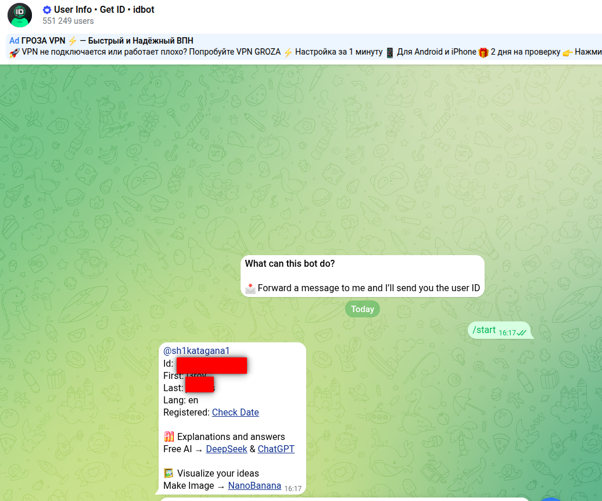
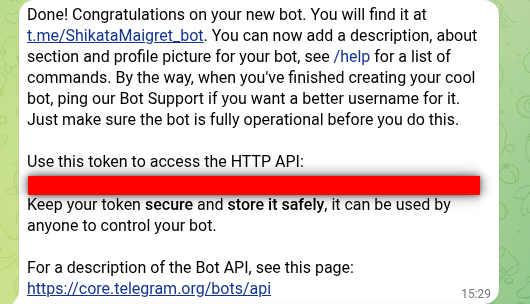
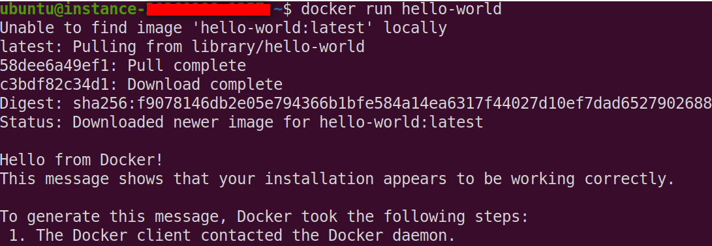
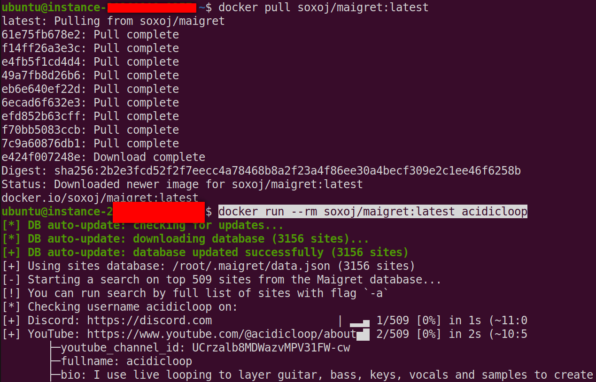
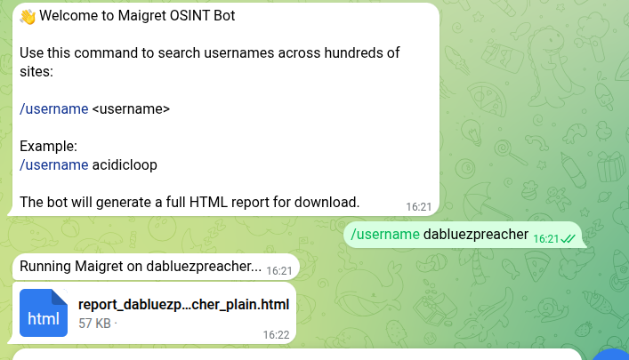

# Intel Bytez - Maigret Telegram Bot Guide

***

## Goal
I want to make a Telegram Bot that will utilize the OSINT tool Maigret to search usernames and create an HTML dossier of what sites it find that username on. This HTML file will get created in the Bot channel for me to download. Additionally, I will have it set to only allow usage of the bot for my Telegram ID. Additionally, the Maigret version being used will be the offifical Docker one.

## Setup
1. Create a Telegram Account
2. Create a public facing server. For me I am using an Oracle Ubuntu VM
3. Get your Telegram ID. Search in Telegram for @userinfobot and run that bot. It will give you details about your Telegram user account including the USER ID.



4. Make a new bot. In Telegram search for Botfather and in the channel type in /newbot and follow its instructions. After it is created you will get your bot telegram channel link and your Bot Token. Note this token down for later



## Docker Setup
```
sudo apt update
sudo apt install -y ca-certificates curl gnupg

sudo install -m 0755 -d /etc/apt/keyrings

curl -fsSL https://download.docker.com/linux/ubuntu/gpg | \
sudo gpg --dearmor -o /etc/apt/keyrings/docker.gpg

echo \
"deb [arch=$(dpkg --print-architecture) \
signed-by=/etc/apt/keyrings/docker.gpg] \
https://download.docker.com/linux/ubuntu \
$(. /etc/os-release && echo "$VERSION_CODENAME") stable" | \
sudo tee /etc/apt/sources.list.d/docker.list > /dev/null

sudo apt update
sudo apt install -y docker-ce docker-ce-cli containerd.io docker-buildx-plugin docker-compose-plugin

sudo systemctl enable docker
sudo systemctl start docker

sudo usermod -aG docker $USER
newgrp docker
```
Test it to verify it is running and working properly
```
docker run hello-world
```


Now pull the Maigret official build
```
docker pull soxoj/maigret:latest
```
Then run it to test it
```
docker run --rm soxoj/maigret:latest acidicloop
```


Our bot will run via Python, so we need to set that up so we can install the telegram bot package
```
sudo apt install python3-venv python3-full -y

mkdir ~/maigret-bot
cd ~/maigret-bot

python3 -m venv venv
source venv/bin/activate

pip install python-telegram-bot
```


Create the bot script
```
nano bot.py
```

Here is the script itself
```
import os
import subprocess
from telegram import Update
from telegram.ext import ApplicationBuilder, CommandHandler, ContextTypes

TOKEN = "YOUR_BOT_TOKEN_HERE"

# 🔐 Restrict bot usage to you
ALLOWED_USER_ID = 1234567890


# 👋 /start command
async def start(update: Update, context: ContextTypes.DEFAULT_TYPE):
    message = (
        "👋 Welcome to Maigret OSINT Bot\n\n"
        "Use this command to search usernames across hundreds of sites:\n\n"
        "/username <username>\n\n"
        "Example:\n"
        "/username acidicloop\n\n"
        "The bot will generate a full HTML report for download."
    )
    await update.message.reply_text(message)


# 🔍 /username command
async def username(update: Update, context: ContextTypes.DEFAULT_TYPE):
    if update.effective_user.id != ALLOWED_USER_ID:
        return

    if not context.args:
        await update.message.reply_text("Usage: /username <name>")
        return

    user = context.args[0]
    base_dir = os.getcwd()

    await update.message.reply_text(f"Running Maigret on {user}...")

    try:
        subprocess.run([
            "docker", "run", "--rm",
            "-v", f"{base_dir}:/data",
            "soxoj/maigret:latest",
            user,
            "--html",
            "--folderoutput", "/data"
        ], check=True)

        html_files = [
            os.path.join(base_dir, f)
            for f in os.listdir(base_dir)
            if f.endswith(".html")
        ]

        if not html_files:
            await update.message.reply_text("Error: No HTML report found.")
            return

        latest_file = max(html_files, key=os.path.getctime)

        with open(latest_file, "rb") as f:
            await update.message.reply_document(f)

        os.remove(latest_file)

    except Exception as e:
        await update.message.reply_text(f"Error: {e}")


# 🚀 Run bot
def main():
    app = ApplicationBuilder().token(TOKEN).build()

    app.add_handler(CommandHandler("start", start))
    app.add_handler(CommandHandler("username", username))

    print("Bot running...")
    app.run_polling()


if __name__ == "__main__":
    main()
    
```
Two things to modify here:
1. Token - In the initial setup instructions I showed you how to set up a new bot and to note down the Bot Token it assigns to you. This is the token you put here
2. ALLOWED_USER_ID - I gave you instructions to find your telegram ID, put that here.

Test your bot manually
```
python3 bot.py
```
It should start with no errors and hang there. Go to your Telegram Bot Channel and do /start. This should show you instructions. Then do /username <username> and it should say its Running Maigret and eventually present an HTML for you to download.



Next we want to make it persistent across reboots. We do this with a service file.
```
sudo nano /etc/systemd/system/maigret-bot.service
```
For the service file put this:
```
[Unit]
Description=Maigret Telegram Bot
After=network.target

[Service]
User=ubuntu
WorkingDirectory=/home/ubuntu/maigret-bot
ExecStart=/home/ubuntu/maigret-bot/venv/bin/python /home/ubuntu/maigret-bot/bot.py
Restart=always

[Install]
WantedBy=multi-user.target
```
Note the Working Directory, User and ExecStart may be different for you depending on your instance name and location. Change accordingly. 

Next we want to enable the service and start it up
```
sudo systemctl daemon-reexec
sudo systemctl daemon-reload

sudo systemctl start maigret-bot
sudo systemctl enable maigret-bot
```

You can check logs for errors (Optional)
```
journalctl -u maigret-bot -f
```

## Flow
Your bot and script is essentially doing this:
```
Telegram message → Python bot → Docker → Maigret → HTML file → back to Telegram
```

## Script Explanation
### Imports
```
import os
import subprocess
from telegram import Update
from telegram.ext import ApplicationBuilder, CommandHandler, ContextTypes
```
1. os → interact with filesystem (find/delete files)
2. subprocess → run shell commands (this is how you call Docker)
3. telegram → represents incoming messages
4. telegram.ext → framework that handles commands like /start

### Config (tokens + access control)
```
TOKEN = "YOUR_BOT_TOKEN_HERE"
ALLOWED_USER_ID = 1234567890
```
1. TOKEN → connects your script to your Telegram bot
2. ALLOWED_USER_ID → security filter

Without this check, anyone on Telegram could run OSINT scans on your server.

### /start command (user interface layer)
```
async def start(update: Update, context: ContextTypes.DEFAULT_TYPE):
```
1. update → the message object from Telegram
2. context → extra data (arguments, bot state, etc.)

```
await update.message.reply_text(message)
```
1. Bot sends a message back to the user
2. await = “don’t block the system while sending”

This is purely user experience, no logic, just instructions.

### /username command (core logic)
```
async def username(update: Update, context: ContextTypes.DEFAULT_TYPE):

if update.effective_user.id != ALLOWED_USER_ID:
    return
```
1. Reads sender’s Telegram ID
2. If it’s not you → silently exits

This prevents abuse and protects your server.

```
if not context.args:
```
1. Checks if user typed a username
2. /username alone → invalid

```
user = context.args[0]

/username acidicloop
```
Just gives an example of a username.

```
base_dir = os.getcwd()
```
This gets the working directory. For me its /home/ubuntu/maigret-bot for you its likely something different. This directory is mounted into Docker and its where HTML files are saved.

```
await update.message.reply_text(f"Running Maigret on {user}...")
```
Shows the user in the user interface that Maigret is running.

### Run Docker (CORE ENGINE)
```
subprocess.run([
    "docker", "run", "--rm",
    "-v", f"{base_dir}:/data",
    "soxoj/maigret:latest",
    user,
    "--html",
    "--folderoutput", "/data"
], check=True)
```
1. "docker run --rm" - starts a temporary container then deletes it after completion
2. -v base_dir:/data is a volume mount. As this is running inside of a container, to get the output made via the --html flag, it has to "escape" the container and drop that file in your local machine directory. This is what this command is doing.
3. "soxoj/maigret:latest" is the official Maigret image and it contains everything needed to run scans.
4. user - this is passed directly to Maigret and becomes the target username
5. --html - This tells Maigret to generate report in HTML
6. --folderoutput /data - This tells Maigret where to save it, /data maps to your host machine

Then we need the script to find this file based on how Maigret generates names for its output files:
```
html_files = [
    os.path.join(base_dir, f)
    for f in os.listdir(base_dir)
    if f.endswith(".html")
]

latest_file = max(html_files, key=os.path.getctime)
```
In this case, whatever the latest html file that was created in this directory. 

### Send file to Telegram
```
with open(latest_file, "rb") as f:
    await update.message.reply_document(f)
```
1. opens file in binary mode
2. uploads it to Telegram
3. appears as downloadable attachment

### Cleanup
```
os.remove(latest_file)
```
1. prevents disk clutter
2. keeps system clean over time

### Error Handling
```
except Exception as e:
    await update.message.reply_text(f"Error: {e}")
```
If anything fails:
1. Docker error
2. file missing
3. permission issue

You get feedback instead of silent failure

### Main Function
```
def main():
```
This sets up the bot.

### Build Application
```
app = ApplicationBuilder().token(TOKEN).build()
```
1. connects to Telegram servers
2. authenticates using your token

### Register Commands
```
app.add_handler(CommandHandler("start", start))
app.add_handler(CommandHandler("username", username))
```
This maps:
1. /start → start()
2. /username → username()

### Start Bot Loop
```
app.run_polling()
```
1. constantly checks Telegram for new messages
2. triggers functions when commands are received

This is your bot’s “heartbeat”

### Script Entry Point
```
if __name__ == "__main__":
    main()
```
1. only runs when script is executed directly
2. not when imported as a module


